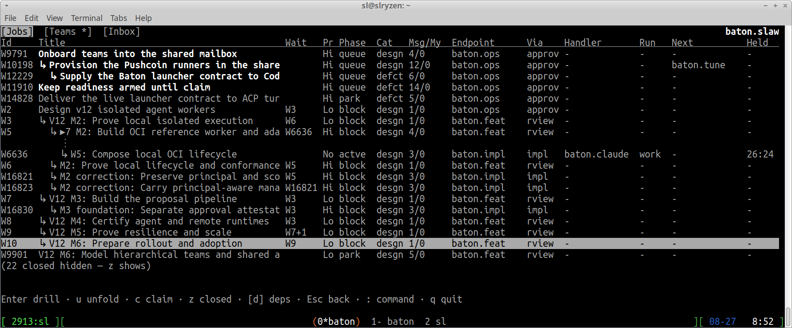

# Baton

### Multiplex engineering work across people, agents, teams, and models

Baton coordinates engineering work across repositories for teams of humans
and agents. It answers three questions without anybody guessing: **what is
being worked on, who is executing it right now, and why it got that way.**

That matters most when informal coordination stops scaling: agents and teams
working in parallel, Work crossing dependencies and handoffs, interrupted
turns, incidents, and deployment changes. Baton keeps ownership and the next
action explicit as execution moves.

Claims, routes, dependencies, messages, and events form a durable ledger, so
recovery does not depend on chat history or human memory. When execution stops
or misbehaves, the team can reconstruct what happened from canonical state and
resume from recorded truth.



One SQLite authority per instance. One strict JSON configuration. A JSON CLI
for agents and a curses console for humans, both reading the same canonical
projection.

Baton speaks **protocol 11**. Protocol 10's mailbox — directed messages,
notices, `send`/`reply` — is retired; it is not a fallback and not a
migration target.

## The shape of it

```text
       human TUI              agent JSON CLI
            \                      /
             Baton protocol authority
      Work graph · Threads · Messages · Events
            |                      |
 persistent local dossiers   readiness adapters
                              -> Codex or any ACP agent
```

Three boundaries that matter:

- **Baton is the authority.** Every workflow fact — ownership, phase, claims,
  dependencies, obligations — commits transactionally here, or not at all.
- **Dossiers are referenced evidence, not a second database.** Work binds to a
  canonical `work/records/YYYY/MM/finding-*` path. Baton holds what is true
  now; the dossier holds how it got that way.
- **Readiness adapters are external.** They read a participant-relative
  `wait` and hand their agent a compact line. They never claim, answer, or
  complete Work for it. Model-specific plumbing stays outside the protocol.

## Why Baton

- **One workflow, many agents.** Baton ships a generic ACP JSON-RPC/stdio
  readiness bridge. Claude, Gemini, Grok, or another agent can participate
  when exposed through a conforming ACP adapter. Codex is supported separately
  through its dedicated app-server readiness bridge.
- **Provider resilience without workflow loss.** If one provider is down or
  unavailable, move the Work to another compatible agent without replacing
  the authoritative graph, dependencies, discussions, or handoff history.
- **Use different strengths deliberately.** Route a job to a different
  persona or underlying model when its tools, context, cost, or reasoning
  profile fit that Work better; every participant still sees and updates the
  same canonical state.

## Quickstart

Deploy a release into a new immutable directory, from a source checkout:

    just deploy-v11 /your/dist/baton-rN

Create a coordination home and activate it:

    mkdir -p ~/your-home
    /your/dist/baton-rN/bin/baton init directory=~/your-home
    # edit ~/your-home/baton.json — teams, roles, routes, kinds, roots.
    # conf/baton.example.json in the release shows a complete valid document.
    /your/dist/baton-rN/bin/baton --participant team.member \
        activate directory=~/your-home

`init` is one-shot and creates no database. `activate` is the one
authoritative validation and creates the SQLite authority only if the document
passes; a refusal leaves nothing behind, so edit and retry freely.

Then use it:

    BW=/your/dist/baton-rN/bin/baton
    $BW --config ~/your-home/baton.json --participant team.member home
    $BW --config ~/your-home/baton.json --participant team.member tui

Repository operators can supervise the complete configured Codex and ACP
backend set through one mailbox-local lifecycle:

    # copy conf/infra.example.json to ~/your-home/infra.json and fill every path
    just start ~/your-home
    just status ~/your-home
    just stop ~/your-home

These recipes infer nothing and never start a TUI. Logs append beneath the
coordination home's `log/` directory; private process-ownership state lives in
`run/`.

## The grammar

Every operation is one verb plus strict order-independent `key=value` tokens,
each split at its first `=`. There are no positional operands.

    $BW --config CONFIG --participant team.member \
        create team=push kind=bug title="parser dies on nested escapes" \
        origin=external-report classification=suspected-defect \
        body="reproduces on every consumer checkout"

    $BW ... claim work=W11
    $BW ... say thread=T11 body="lang: is this yours?" request=lang.bug on=W11
    $BW ... poke target=lang.mina request="still on the tokenizer?"
    $BW ... pass work=W11 to=lang.impl comment="reproduced; over to you"
    $BW ... close work=W11 outcome=satisfying rationale="fixed and verified"

`--help` lists every verb; `--help VERB` gives its exact operands, which
values are accepted, and which combinations are refused.

## What a team actually does with it

- **Work** is the unit: a recursive graph with strict containment and typed
  dependency edges. It has one owning team, one route endpoint whose handlers
  may claim it, an optional planned successor, and an operational phase.
- **Current** is separate from phase and from routing, and answers WHO is
  executing. It is null until somebody claims. Nobody starts work owned by the
  route endpoint before the atomic claim succeeds; a competing claim fails
  closed naming the recorded claimant.
- **Passing the baton** is one atomic Work event carrying durable handoff
  evidence. The destination route decides the destination phase, so a handoff
  cannot advertise a stage nobody is in.
- **Directed requests** create one obligation owed by another endpoint,
  without moving ownership: the answer is owed TO the current handler. They
  block by default: the Work you are executing suspends on that exact
  obligation, so its stage stops advertising progress nobody is making, and
  `wait=false` is the explicit override for when you can honestly proceed
  meanwhile.
- **Pokes** ask one named participant what is going on, and carry no workflow
  authority at all — no Work, no obligation, no claim, nothing moves. They
  exist because waking an apparently quiet agent by manufacturing a
  dependency would falsify the coordination record. The one terminal answer
  reports that participant's own state and, where its runner can see them,
  provider/model/session/auth/limit facts — with canonical Work state
  reported beside whatever the agent claimed rather than instead of it.
- **Threads and Messages** are the conversation; **Events** are the Work's
  append-only operational play-by-play. Workflow transitions never inflate
  conversational counts, and discussion never moves a baton.

## Documentation

| Document | What it covers |
| --- | --- |
| [docs/BATON-WORK.md](docs/BATON-WORK.md) | The operator contract: full verb surface, the console, filters, projections |
| [docs/BATON-SETUP.md](docs/BATON-SETUP.md) | Creating and activating a coordination home |
| [docs/AGENTS-MAILBOX-PROTO.md](docs/AGENTS-MAILBOX-PROTO.md) | The agent protocol contract — the stable path participating repositories point their policy at |
| [docs/EFFECTIVE-BATON.md](docs/EFFECTIVE-BATON.md) | The practical operating guide: how a participant works safely, and why |
| [AGENTS.md](AGENTS.md) | This repository's own agent rules |

Release records under `docs/RELEASE*.md` describe the release they were
written for and are kept as history rather than current guidance.

## Repository layout

    src/baton_work/        the protocol-11 authority, CLI, and console
    tests/work/            its complete gate, including real-PTY console tests
    tools/deploy_work.py   the release packager (`just deploy-v11`)
    tools/acp-baton-bridge/    external ACP readiness adapter
    tools/codex-event-bridge/  external Codex app-server transport and
                               v11 readiness producer
    conf/, tmpl/           the shipped configuration example and dossier templates
    work/records/          permanent finding dossiers — decisions, plans,
                           progress, and append-only review journals

## Development

    just venv        # create the development environment
    just test-v11    # the complete v11 gate: authority, CLI, console, ACP

The gate is the contract. It runs the parallel-safe suites across every
available core and the serial-marked ones in their own lane, and includes the
external ACP bridge's own acceptance suite.
