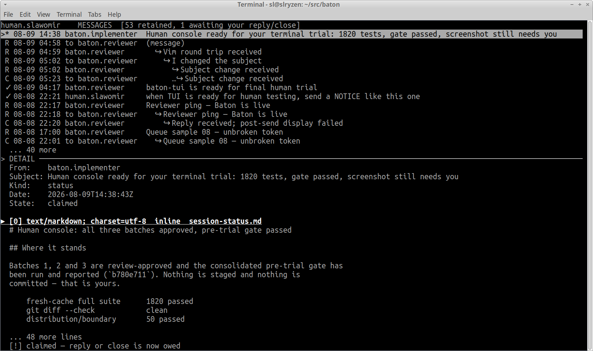

# Baton — coordination between humans and AI agents

Baton is a standalone coordination tool for agents and humans, providing
role-addressed handoffs, broadcast notices, and audited administrative
operations over a single SQLite database. It has no dependency on any host
project; every instance is defined entirely by one explicitly passed
strict-JSON config.

Baton needs no Internet connection or coordination service. It runs fully
offline and can be completely sandboxed. Participants coordinate as peers
through a shared SQLite mailbox; there is no privileged coordinator, daemon,
or always-on server.

## Why Baton exists

The world is still learning how humans and AI agents should work together.
Agents need enough context to preserve technical detail and make sound
decisions. Humans coordinating many agents and projects need the opposite
view: concise subjects, summaries, clear obligations, and visible outcomes.
Neither side should have to give up the information the other needs.

Without an adapter between those views, the human becomes the adapter:
scrolling through transcripts, watching terminals, relaying messages, and
hand-editing plans just to discover what needs attention. That does not scale
as the number of agents, teams, and concurrent projects grows.

A second problem is continuity. An agent can lose session context after a
restart, crash, context reset, or other interruption, and reconstructing that
context costs time and risks changing decisions that were already settled.
Context is also difficult to transfer when a team switches to a different
model -- whether a better, faster, or less expensive model from the same
vendor, or one from another vendor.

Developers compensate with findings, plans, progress journals, and other
files. Those records remain essential, but their usefulness depends on every
participant following the same conventions consistently. Baton adds a durable,
model-independent communication record: handoffs, replies, decisions,
references, and outstanding obligations survive process failures and can be
picked up by a replacement participant on a heterogeneous system. A restart
should interrupt work, not erase the team's shared understanding of it.

Baton keeps the short operational view and the full record together. A
one-line subject makes an inbox scannable; typed multipart content,
references, and durable findings preserve the context behind it; claims and
dispositions show who owes the next action and whether it is done. The goal is
not to discard complexity, but to present each participant with the amount of
it they need at that moment.

## How a team uses Baton

A team gives each participant a scoped address such as `team.implementer` or
`team.reviewer`. The implementer publishes a handoff to the reviewer. One
reviewer claims it, completes the review, and replies through the same
transactional channel. The implementer then receives that response. Baton
records who claimed and completed each handoff, prevents two consumers from
owning the same work, and preserves durable reports for later inspection.

Addresses are not limited to implementation and review. A deployment can add
participants such as `team.security`, `team.release`, or `org.lead` without
changing the protocol. Broadcast notices provide status updates that every
participant may see but nobody claims.

## Quick example

The included example config defines an implementer, a reviewer, and a lead.
Create a temporary mailbox instance:

    BATON="$PWD/bin/baton"
    DEMO=/tmp/baton-demo
    mkdir -p "$DEMO"
    cp example-baton.json "$DEMO/baton.json"
    "$BATON" --config "$DEMO/baton.json" init

The implementer publishes a durable handoff:

    printf '%s\n' '# Handoff' 'The implementation is ready for review.' > "$DEMO/handoff.md"
    "$BATON" --config "$DEMO/baton.json" send \
      --participant team.implementer \
      --to team.reviewer --kind implementation_handoff --retention durable \
      --subject "Payment retry logic ready for review" \
      --body "$DEMO/handoff.md"

The reviewer waits for work. `wait` is READ-ONLY: it blocks until something is
there and says what, taking none of it.

    "$BATON" --config "$DEMO/baton.json" wait \
      --participant team.reviewer

    {"ready": true, "channel": "message", "message_id": "...",
     "from_participant": "team.implementer", "kind": "implementation_handoff",
     "created_ts": "...", "damaged": false}

Then take THAT message. Pass the `message_id` readiness reported rather than
running a bare `claim`: bare `claim` selects the oldest CLAIMABLE message,
which skips a damaged head and may pick a different message if the queue moved
in between. Naming the id is what makes the two steps one decision.

    MESSAGE_ID="paste-message-id-here"
    "$BATON" --config "$DEMO/baton.json" claim \
      --participant team.reviewer --message-id "$MESSAGE_ID"

`claim` prints the message and its `claim_id`.

After reviewing, copy that `claim_id` into the reply command:

    CLAIM_ID="paste-claim-id-here"
    printf '%s\n' '# Review' 'Approved.' > "$DEMO/review.md"
    "$BATON" --config "$DEMO/baton.json" reply "$CLAIM_ID" \
      --participant team.reviewer \
      --kind review --outcome approved --retention durable \
      --body "$DEMO/review.md"

The implementer receives the response with the same participant identity used
to send the handoff — the same two steps, and the same rule about naming the
id `wait` reported. Capture the SECOND wait's id; reusing the first one would
name the handoff this response is answering:

    "$BATON" --config "$DEMO/baton.json" wait \
      --participant team.implementer

    RESPONSE_ID="paste-message-id-from-that-wait"
    "$BATON" --config "$DEMO/baton.json" claim \
      --participant team.implementer --message-id "$RESPONSE_ID"

An explicitly supplied body must contain at least one byte: a zero-byte part
asserts that content exists and is empty, which no sender means. Use `--tweet`
when the subject is the whole message, and `close` when a disposition needs no
content at all.

### One-line messages: `--tweet`

When the whole message IS one line, say so:

    "$BATON" --config "$DEMO/baton.json" send \
      --participant team.implementer --to team.reviewer --kind status \
      --tweet "Still testing; give me more time"

    "$BATON" --config "$DEMO/baton.json" reply "$CLAIM_ID" \
      --participant team.reviewer --kind review --tweet "Approved"

The text becomes the message's SUBJECT and no body is published. It is an
ordinary directed message otherwise: same kind, same claim, same reply or
close owed.

`--tweet -` reads the line from stdin and removes exactly one trailing
newline, so an ordinary pipeline works:

    printf 'ship it when the suite is green\n' | "$BATON" ... send \
      --participant team.implementer --to team.reviewer --kind status --tweet -

Only the line terminator is forgiven — a leading space or a second newline is
still refused, because the text has to be a valid subject: one line, no
control characters, at most 255 bytes of UTF-8.

`--tweet` is EXCLUSIVE with `--subject` and with every content option
(`--body`, `--part`, `--references`, `--attach`, `--content-type`,
`--disposition`, `--part-name`). Combining them is refused rather than
resolved: dropping the body would lose content, and dropping the flag would
make it decorative. Notices do not have `--tweet` — a broadcast has no
recipient obligation to carry its meaning forward.

WHY IT IS AN EXPLICIT OPTION. The alternative was to treat "no body supplied"
as a subject-only message. But an absence is also what a broken pipe, a
truncated heredoc, or a missing input file looks like — so an empty message
would be reachable by accident, which is exactly how zero-byte messages were
being published before this existed.

### Quick inline messages with a body

Short ACKs and decisions that DO have a body do not need temporary files. Pass
`--body -` and pipe the bytes on standard input (`send` and `reply` also
default their body to stdin):

    printf '%s\n' "I'm still working and testing; give me more time." | \
      "$BATON" --config "$DEMO/baton.json" send-notice \
      --participant team.implementer \
      --kind working_status --ttl-seconds 3600 --body -

That status is broadcast, wakes `wait`, records no claim, and needs no reply
or close — read it with `see`. Use a directed `send` when a particular recipient must acknowledge
and disposition the message:

    printf '%s\n' 'Ready for review.' | "$BATON" --config "$DEMO/baton.json" send \
      --participant team.implementer \
      --to team.reviewer --kind ping --retention transient --body -

    printf '%s\n' 'Approved.' | "$BATON" --config "$DEMO/baton.json" reply "$CLAIM_ID" \
      --participant team.reviewer \
      --kind review --outcome approved --retention durable --body -

A notice can address one team instead of everyone. The scope is a dotted
participant prefix ending in `.*`, and it must be QUOTED so the shell does not
expand it against the working directory:

    printf 'ready for review\n' | "$BATON" --config "$DEMO/baton.json" send-notice \
      --participant team.implementer --kind status --scope 'team.*' --body -

The audience is expanded against the configured participants and FROZEN when
the notice is published — for a global broadcast too. A participant added
later does not acquire an older notice: a broadcast is to the people who
existed when it was sent. `dump` records exactly who was addressed, and the
detail header shows the scope so a reader can tell a team notice from a
global one.

### Assigning one piece of work to several participants

`--to` is repeatable. Each recipient gets their own pending delivery, claim
and disposition, so one of them closing their copy leaves the others'
untouched — this is N ordinary messages sharing one immutable content, not a
group thread:

    "$BATON" --config "$DEMO/baton.json" send \
      --participant team.lead \
      --to team.implementer --to team.reviewer \
      --kind design_question --subject "Which retry window?" --body -

A wildcard is REFUSED here. `--to 'team.*'` is an error rather than a
convenience: work assigned to a scope would have no per-recipient claim, which
is exactly what makes a directed message different from a notice. Naming the
same participant twice is refused too, rather than quietly deduplicated.

Every recipient's delivery names the whole audience, so a reader can tell work
deliberately shared with three people from a private request. A reply still
goes only to the original sender.

### Repeating a send whose result you did not see

Publication is at-least-once. If a `send` or `send-notice` was interrupted
after it may have committed, you can repeat it and mark the repeat:

    "$BATON" --config "$DEMO/baton.json" send \
      --participant team.lead --to team.reviewer --kind ping \
      --possible-duplicate --body -

The mark is YOUR assertion that you could not tell whether the first attempt
landed, and it is immutable once written. Baton does not correlate the two —
it has no token to correlate them by — so it never claims to have proved a
duplicate; it shows recipients what you said, and they decide how to handle
the second copy. Two deliberate identical sends are just two sends, unmarked.

This does not apply to `reply` and `close`, which are addressed by `claim_id`
and are already effectively-once: retrying one either redelivers the committed
result or fails closed.

Substantive reviews and implementation responses should remain durable bodies
and be materialized into whatever review folder the consuming project uses
(`materialize --dir DIR --prefix P`). The file is a human-facing artifact;
short protocol acknowledgements stay inline. Where those folders live, and how
they are named, is the consuming project's policy — not Baton's.

For production use, keep the config and SQLite database in a dedicated local
instance directory outside participating project trees. Each participant
runs exactly one active consumer path; two consumers need two participant
addresses, not one shared identity.

## Human terminal inbox

`baton-tui` is the separately packaged, SSH-friendly human console. Start it
with the same explicit instance config and participant address used by the
CLI:

    /absolute/path/to/bin/baton-tui \
      --config /absolute/path/to/baton.json \
      --participant human.operator

The screen is stacked: a full-width message list on top, one horizontal rule,
and a full-width detail pane below it, with the status bar on the bottom row.
The list is newest-first, so new work is at the top and history is below it;
delivery order is unaffected, and `claim` still takes the oldest pending
message.

**Highlighting an inbound directed message claims it and shows its body** —
moving with the arrow keys or `j`/`k` takes ownership of the row you land on,
because scrolling to a message and then pressing a second key to read it is a
ceremony a human console does not need. Moving across several pending messages
therefore leaves several claims owed; nothing is ever auto-closed, the header
counts what you owe, and quitting with work outstanding asks first.

A broadcast is different and stays explicit: highlighting one shows only its
headers, and `Enter` is what marks it seen and returns its text. Once a
directed message is open, `r` replies — straight into your external editor,
because that is the reply people actually write — `R` is the quick one where
the subject line IS the message, and `c` closes. `n` opens the recipient
picker. `Tab` moves focus between the list and the detail pane, and the
navigation keys follow it; `Enter` from the list is the forward half of that
— it opens the selected message and moves focus into the detail pane. `Enter`
does not toggle back: `Tab` is the reversible one.

`Enter` is also the explicit way to open a pending message without waiting out
the two-second dwell. The dwell exists so that scrolling past work does not
claim it; pressing a key is not scrolling past. The message body starts at the top of the detail pane; a fixed footer on the
pane's last row says which part you are on and how many there are:

    ▸ [0] text/markdown; charset=utf-8  inline  (1/1 parts)

For multipart messages, `[`/`]` select the previous/next part — updating that
footer and bringing the part's content into view — and `m` materializes the
selected part into the participant's configured projection directory. `[0]` is
the part's ADDRESS in the manifest, not a name; a part that has a name shows it
separately. A subject-only message says `0 parts` and invents no address. The status bar keeps claim obligations and errors
visible.

Each row carries a one-cell status column before the date. Alignment, not
punctuation, marks its boundary:

It answers one question: **does someone wait on you, and if so have you read
it and answered?** The exact protocol state stays in the detail pane; this is
how the list reads.

While an item is **live**, the glyph says who owns the next action:

| glyph | meaning |
|---|---|
| `•` | addressed to you and not yet opened |
| `○` | opened and yours — a reply or close is still owed |
| `▷` | you sent it; the recipient has not picked it up |
| `▶` | they picked it up — the next action is owed by them |
| `!` | a notice you have not seen |

Once it is **done**, direction stops mattering — the party column already says
who acted — so the same mark is used whichever side answered:

| glyph | meaning |
|---|---|
| `✓` | nothing is owed — replied, closed, or a notice you have seen |
| `E` | expired |
| `X` | quarantined |
| `N` | a notice you authored |
| `~` | content withheld — its parts failed their pins |
| `?` | a state this console does not understand — worth reporting |

Whether a message was replied to or closed is in the detail pane, exactly. The
list answers the question you scan for — is anything still owed — and does not
spend a cell repeating an answer you can read in full one pane down.

Where the terminal cannot draw them, `•○▷▶✓` fall back to `*`, `o`, `Q`, `P`
and `D`. That is a fallback spelling, not the notation.

The panes themselves carry message content and nothing else. The bottom row is
a single status line reporting what the console did; `?` opens the full
shortcut and lifecycle reference, and this file carries the same notation.
Both panes get the whole terminal width, which is what a subject line and a
Markdown body each need most.

The TUI and agent CLI are separate artifacts built from the same shared
`baton-core` package, so there is one implementation of the protocol behind
both. They ship independently: the console declares the core API version it
was built against, which lets it move on its own cadence while the wire
contract moves on the protocol's.

## Minimum requirements

Requires Python 3.11 or newer, Linux, and SQLite 3.37.0 or newer on a local
filesystem. No third-party Python packages are required. Missing runtime
requirements fail closed with documented exit code 2.

## Development

The checked-in `justfile` provides the local development workflow. These
recipes require `just`, but the shipped Baton executable does not. The
repository-local `.venv` contains development tooling only; Baton remains a
stdlib-only zipapp.

- `just venv` creates `.venv` when needed and installs the pinned packages in
  `requirements-dev.txt`.
- `just test` runs the complete protocol, core, TUI, PTY, parity, and
  packaging-isolation suite.
- `just build` rebuilds the deterministic `bin/baton` zipapp and refreshes
  `DISTRIBUTION.json`.
- `just build-tui` independently rebuilds `bin/baton-tui` and refreshes
  `DISTRIBUTION-TUI.json` without invoking the CLI builder.

After a fresh clone, run `just venv` once, then use `just test` for normal
verification. Test and build recipes fail with a direct instruction if the
local venv has not been bootstrapped.

## Instance

An instance is a directory holding `baton.json` (the config, always passed
explicitly via `--config`) and `mailbox.sqlite3` (the single authority; its
WAL/SHM siblings belong to SQLite). There is no other authoritative file.
Create one with:

    baton --config /abs/path/instance/baton.json init

See `example-baton.json` for the config shape: participants are dotted
addresses, and the address is the whole identity — there is no actor and no
seed. Administrative authority is granted ONLY by an explicit
`capabilities` list (`recovery`, `config`) — never inferred from identity.
`roots` name the directories attachments may reference. `retention_days`
bounds transient-metadata garbage collection.

## Core commands

`send` (body from stdin/file and/or `--attach ROOT:REL/PATH`), `send-notice`
(finite TTL, default 86400s), `claim` (one lossless delivery: claim metadata
plus the typed content envelope), `wait`
(blocks until work exists and reports READINESS ONLY — no claim, no receipt;
consume with `claim` or `see`, see below),
`reply` / `close` (effectively-once: retries redeliver the committed
disposition and mismatches fail closed), `see` / `expire` (notices),
`recover-claim` (requires the `recovery` capability and a reason),
`quarantine-attachment` (terminal disposition for a message whose pinned
attachment no longer verifies; requires `recovery` and a reason — see below),
`snapshot` (validated copy of a maintenance-gated instance; requires
`config`), `gc`, `regen` (accept a generation+1 config; requires `config`),
`scan`, `doctor`, `dump`, `inspect`, `materialize` (participant-scoped
reread of a message or an already-seen notice).

`migrate` is an audited gate, not a conversion capability. It requires the
participant's `config` capability and the maintenance gate, durably audits the
attempt, and then refuses with exit 4 — this build knows one protocol and has
no path to convert an instance from another. A migration path is added only
alongside a protocol bump. To move an instance to a newer protocol, retire it intact and start a
fresh one at the target protocol: coordination comes back in minutes, and
anything still needed is re-sent. Converting in place keeps more history but
takes the channel down for the whole conversion, including for whoever would
have to review it.

## Damaged external parts

An external part is hash-pinned when the message is published, so editing the
file afterwards invalidates the pin. `claim` **skips** such a message and
delivers the next healthy one, rather than failing the whole queue; naming it
explicitly with `--message-id` still fails closed.

`wait` does NOT skip it. Readiness reports the head of the queue as it stands,
with `damaged: true` — the two verbs answer different questions, and an
observation that quietly stepped over a damaged message would report the queue
as healthy and shorter than it is. A message is
damaged if ANY of its external parts is: delivering the healthy parts alone
would deliver an incomplete statement. Skipped damage is listed by `scan`
under `damaged`, per part, and by `doctor`.

A skipped message stays pending until dispositioned. `quarantine-attachment`
is that disposition: it records the damaged part — by id and manifest address —
along with its original pin and the observed failure, in a permanent audit row and moves the message to a terminal `quarantined` state,
without ever claiming it — damaged content is never delivered, so no claim is
created. An already-terminal message is acknowledged without rewriting its
history. `doctor` then reports the damage as an acknowledged warning rather
than an unresolved problem.

The practical lesson: send a document that is still being edited as a
`--body`, which is copied into the store, and attach only what is final.

## What `wait` reports

`wait` blocks until work exists on either inbound channel and prints
readiness — metadata only. It writes nothing: no claim, no notice receipt, no
ledger event.

    {"ready": true, "channel": "message", "message_id": "...",
     "from_participant": "...", "kind": "...", "created_ts": "...",
     "damaged": false}
    {"ready": true, "channel": "notice"}

Consumption is a separate, explicit step: `claim` for directed work, `see` for
a notice. There is deliberately no second spelling of `wait` — no `ready`
verb, no `scan --wait`.

For runner loops, the EXIT CODE is the whole answer and the JSON is detail:

    0    work exists; the readiness object was printed
    3    the timeout elapsed with nothing waiting

So a supervisor can branch on the status without parsing anything, and `3` is
an ordinary idle result rather than an error.

WHY IT IS SPLIT. `wait` used to claim the message it returned, which made the
most obvious command the one that is unsafe to leave running. An agent host
can put a long-running terminal in the background and never wake the agent
when it exits; the claim is then held with nobody able to answer it. Now a
missed wake DELAYS work instead of holding it. Several consumers may wake for
the same message — `claim` remains the transaction that decides who owns it.

A directed message always wins when both channels have something, so claimable
work is never delayed behind advisory broadcast.

Readiness reports the HEAD of the queue in `(created_ts, id)` order, healthy or
damaged, and never looks past it. `damaged: true` means the next message has a
pinned attachment that changed after publication: what it needs is
`quarantine`, not `claim`. Reporting the healthy message behind it would answer
"what could be claimed" instead of "what is next", and would leave the damaged
head unmentioned.

A notice result does NOT name the notice. `see` drains oldest-first, so naming
one would invite consuming a specific notice under another one's name.

A notice is never claimed — there is nothing to `reply` to or `close`. The
`notice_seen` receipt commits in the same transaction as the `see` that reads
it, so a notice is delivered at most once per participant. Each participant
receives its own independent copy; there is one receipt per participant,
because the participant address is the whole identity.

That receipt is also why broadcast is **at-most-once**: a consumer that dies
after the commit but before acting on the bytes does not get the notice again.
At-least-once would require per-recipient acknowledgement — that is a claim,
and a notice has no per-recipient message row to claim. Use a directed message
for anything that must not be missed.

Projections: `materialize --participant WHO --dir DIR --prefix P [--part N]`
re-emits one durable content part as a byte-exact `P-<created>-<id>.md` file.

`--participant` is REQUIRED, and the read is authorized against the immutable
publication-time audience: you may read back a message you sent or were
addressed in, and a notice you authored or have already SEEN. Rereading a
notice writes no second receipt — at-most-once is a property of delivery, and
you already had these bytes. A non-party is refused exactly as an unknown id
is, so the surface says nothing about what exists.

The `recovery` capability does not grant this: it repairs claims and is not a
key to other participants' content. The suffix
follows the part's declared media type; part `0` keeps the unsuffixed name and
any other part appends `-part<address>`. The prefix is an EXPLICIT caller
choice; participants' configured `projection_prefix`/`projection_dir` define
which files `doctor` owns and inventories (orphans are warnings).

## Subject

`--subject` is a one-line human summary — what an inbox shows before anything
is opened. It is immutable, carried losslessly to delivery, and listed by
`scan`, so a consumer can triage without fetching bodies.

It is optional: status and machine traffic can fall back to `kind`. When
supplied it must be a single line of plain text with no leading or trailing
whitespace, no control characters, and at most 255 bytes as UTF-8. Invalid
subjects are **rejected, not sanitized** — a newline in a subject is a
display-injection hazard for anything rendering an inbox, and silently
stripping it would leave the sender believing they sent something they did not.

`reply` inherits the subject it is answering unless given its own, so a thread
reads as one conversation. Retries compare the EFFECTIVE subject: an inherited
retry matches an inherited commit, and an explicit change fails closed.

## Content: typed and multipart-capable

Every body travels as an ordered collection of typed parts, even when there is
exactly one. A delivery carries `content`, not a bare body:

    "content": {
      "content_type": "multipart/mixed",
      "manifest_sha256": "...",
      "parts": [
        {"content_type": "text/markdown; charset=utf-8",
         "disposition": "inline", "part_name": null,
         "size": 17, "sha256": "...",
         "encoding": "text", "text": "# Handoff\nReady.\n"}
      ]
    }

`content_type` is an IANA media type with parameters (RFC 2045). `disposition`
is `inline` or `attachment`, which are RFC 2183's values. `part_name` is
BATON'S OWN field, not RFC 2183's `filename` parameter: it is an uninterpreted
label with no path meaning, and the recipient decides whether it ever becomes
a file. Markdown's `charset` parameter is required by RFC 7763, and Baton
requires it for every `text/*` type.

An **inline** leaf carries EXACTLY ONE delivery representation, named by
`encoding`: `text` for `text/...; charset=utf-8`, `base64` for everything
else. Never both. The choice follows the DECLARED type, not whether the bytes
happen to decode, so a consumer dispatches on one stable key.

`encoding` is `null`, with neither content key present, in two cases: an
**external** leaf, which carries an `attachment` pin instead of bytes, and an
inline leaf whose transient body has been scrubbed — the manifest outlives the
payload. `storage` distinguishes them.

Baton TRANSPORTS content and never renders it. No HTML, no Markdown, no
transcoding: rendering is a consumer concern, and a transport that renders is a
transport with an injection surface. `part_name` is advisory metadata that
Baton never uses to open, create, or name a file; it is validated at
publication anyway, because a consumer downstream may be less careful.

### Inline and external parts

A leaf's bytes are stored **inline** (copied into the store) or **externally**
(`--attach ROOT:REL/PATH`, hash-pinned in a configured root and verified at
claim time). Both are ordinary parts: same media type, disposition, part name,
ordering, size and hash contract, and both are covered by the manifest, so
retry identity is one mechanism rather than two. A delivered leaf states which
through `storage`; an external leaf carries an `attachment` pin and no bytes,
because pointing at the file is the entire reason it lives outside the store.

A message may carry **any mix** of inline and external parts, in any order —
an explanation beside its evidence in one message, or several attachments.
Earlier protocols allowed exactly one attachment and made it mutually
exclusive with content, which forced one statement to be split across two
messages that could interleave on the queue.

An external part whose type the caller does not declare gets
`application/octet-stream` — the RFC 2046 unknown-bytes type, not a guess
sniffed from the file extension.

**External parts are permitted only on directed messages.** A pinned file can
go stale after publication, and only a directed message has the lifecycle to
notice and resolve that: claim-time verification, skip-and-continue, the
audited quarantine ceremony, and `doctor`. A notice has no claim to skip or
quarantine and commits its seen receipt inside the read transaction; a close
disposition is never delivered. Both refuse an external part at publication
rather than publish a pin that nothing verifies.

Parts are their own rows with explicit ordering, so containers nest —
`multipart/alternative` inside `multipart/mixed`, and deeper — without a schema
change. Undeclared content defaults to `text/markdown; charset=utf-8`; bytes
that contradict a declared charset are refused at publication rather than
delivered under a label that misdescribes them.

The CLI reaches the whole of this. `send`, `send-notice`, `reply` and `close`
each take a repeatable `--part DESCRIPTOR`, and `send` and `reply` also take
`--attach` for external storage:

    baton send --participant team.impl --to team.reviewer --kind review \
      --subject 'Q3 numbers' \
      --part 'source=summary.md&type=text/markdown;%20charset=utf-8' \
      --attach evidence:q3/ledger.csv \
      --references refs.txt

A descriptor is an RFC 3986 query. `source` and `type` are required; optional
`disposition` is `inline` or `attachment`, and optional `name` is the advisory
part name. Pairs split at their FIRST `=`, so a media type carrying its own `=`
travels unencoded — but the descriptor as a whole must be query-legal, which
means `%20` for a space and percent-encoded UTF-8 for anything non-ASCII.

**Option order is leaf order**, across `--part`, `--attach` and `--references`
alike. That is not presentation: leaf order is part of the manifest digest and
the manifest is what retry compares. `--body` remains available as the
single-leaf shorthand and becomes the first leaf when combined with
`--attach` or `--references`, carrying its own `--content-type`,
`--disposition` and `--part-name`; it is refused beside `--part`, which already
carries that metadata per leaf. At most one source may be `-`, and that
collision is refused before anything is read.

`--references FILE` publishes a `text/vnd.baton.references; charset=utf-8`
leaf: one `ROOT_ID:RELATIVE/PATH` per line, the same logical address an
external part uses.

    evidence:q3/ledger.csv
    source:baton_core/_impl.py

The root is required because one authority may coordinate several
repositories, and it is checked against the instance's configured roots. The
relative half is checked for portability — no leading `/`, `..`, `~`, Windows
separators, empty components, or edge whitespace — with the offending line
named rather than rewritten.

The shared address is not a shared promise. An external part READS the file,
pins its bytes, and can later fail verification; a reference says where to
look and touches nothing, so the path need not exist. The strictness is the
convenience: `--part` will publish a references-typed leaf with no checking at
all.

Readers must not assume any writer restriction; the storage layer and delivery
envelope carry arbitrary multipart trees, including nesting the CLI does not
yet spell.

Retry identity is the complete ordered part manifest, metadata included. Two
retries that differ in part order, media type, disposition, or part name are
different operations even when every byte matches, and fail closed as
mismatches.

Directed messages and notices use the same content representation.

## Maintenance and moves

`maintenance-enter/exit` gate the instance (exit refuses during a move).
A move binds one source and one destination config path plus their directory
identities immutably at entry; `move-copy`, `move-bind`, `move-activate`,
`move-decommission`, and `abort-move` are exact-token audited ceremonies —
at most one instance with a given UUID can ever be active through the API.

## Exit codes

0 success · 2 minimum requirements unmet · 3 nothing eligible ·
4 validation/usage · 5 race/busy · 6 integrity damage ·
7 gated (maintenance/moved).

## Distribution

`just build` invokes `build_zipapp.py` to build the canonical deterministic
`bin/baton` zipapp and refresh `DISTRIBUTION.json` (tool/protocol versions,
minimum runtime versions, artifact hash). `python3 build_zipapp.py [outdir]`
remains available when building into another distribution root. Same inputs,
same bytes. A complete deployment also ships the generic
`AGENTS-MAILBOX-PROTO.md` beside the executable; consumer projects keep only
their local participant bindings and discover paths from the deployment rather
than hard-coding a checkout or host layout.
