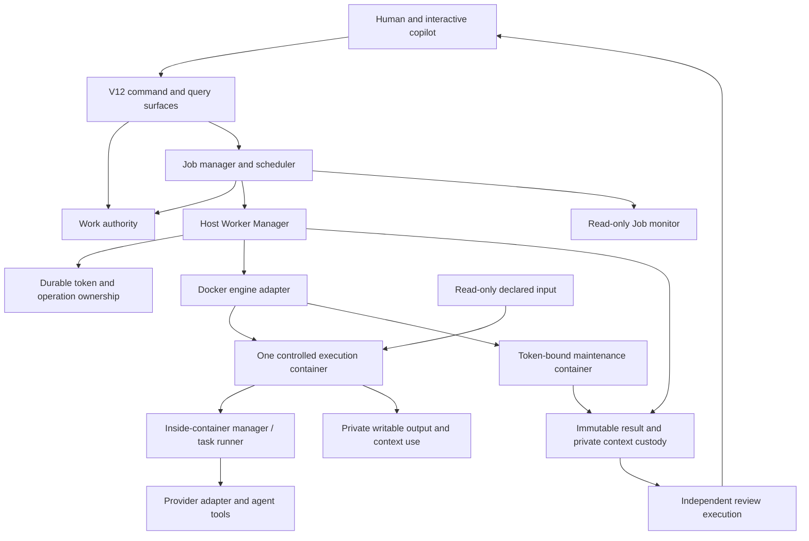

# Baton v12 — normative system design

Status: owner-selected v12 specification. Author: baton.prompt, 2026-09-26.
Independent review status, findings and exact document digests belong in the
[design record](../work/records/2026/09/finding-v12-normative-design/PLAN.md).

## 1. Purpose, scope and authority

This document specifies **Baton v12**: the system we intend to build and follow.
It does not describe the v11 deployment currently used to coordinate development,
and does not certify the existing v12 code as conforming. Implementation must
converge on this specification. Existing code, passing tests and historical
acceptances cannot silently redefine it.

The v12 outcome is useful independent parallel Jobs in isolated Docker workers,
durable reviewed results, safe recovery, working context reuse and a lightweight
read-only Job monitor. Initial adoption may use supported fresh contexts before
reuse is complete; reuse remains a v12 deliverable before moving to v13.

`MUST` and `MUST NOT` identify requirements. Concrete wire formats and algorithms
live in versioned component contracts and bounded implementation plans. This
document fixes their responsibilities, safety invariants and observable behavior;
it does not invent compatibility for a schema that has not been revised.

An owner-approved change MUST update this specification and append the decision
and explicit supersession to its owning finding before dependent implementation.
A conflict or missing product decision MUST be brought to the owner, not resolved
by choosing whichever historical text or current code is convenient. Section 19
records the selected enforcement policies and the parameters that a concrete
implementation/profile must pin; it does not supply guessed defaults.

The records have distinct purposes:

| Record | Responsibility |
| --- | --- |
| This DESIGN | Current v12 requirements and component boundaries |
| Job PLAN and checkpoint | Selected scope, next milestone, owned paths, current evidence and blockers |
| FINDING | Chronological observations, decisions, rationale and explicit supersessions |
| Author PROGRESS | Attributable implementation account |
| Append-only review | Independent assessment of exact candidate bytes and evidence |
| Baton authority | Current Work relationships, routing, claims, gates and disposition |

## 2. System shape

The trusted host is Python. Provider-specific SDKs, CLIs and model adapters live
inside worker images and may use their appropriate language. A provider's module
layout or SDK objects MUST NOT become host protocol vocabulary.



The host manager orchestrates resource ownership and physical enforcement. The
inside-container manager runs the assigned task and supervises its local agent
and tools. They are separate responsibilities even if a small deployment starts
several host components in one process. Neither can substitute its observations
for facts owned by another component.

| Component | Owns | Must not claim |
| --- | --- | --- |
| Work authority | Work identity, route, claim, assignment generation, authorization and durable workflow gates | That a process has stopped merely because a claim ended |
| Job manager/scheduler | Submitted intent, stages, eligibility, capacity allocation, corrections and ending obligations | That a reserved worker executed, or a producer result was accepted |
| Host Worker Manager | Exact attempts, token ownership, launch journal, runtime reconciliation, delivery, custody and cleanup coordination | Git semantics, provider inference, self-authored reviewer verdicts, or unobserved runtime death |
| Docker adapter | Closed create/start/inspect/stop/destroy operations and correlated engine observations | Work authorization or candidate acceptance |
| Maintenance executor | Exact granted filesystem operation in a token-bound container: prepare, freeze, retain, normalize, delete or reset named managed resources | Authority DB access, token grants, arbitrary host paths or acceptance of its own output |
| Inside-container manager | Validate delivered assignment, receipt commands, invoke provider, supervise tools, publish bounded events and completion | Host lifecycle authority, direct DB access, token grants or self-renewal |
| Provider adapter/agent | Conversation, reasoning and authorized task/tool work within confinement | Authority inferred from prose or tool success |
| Source/artifact driver | Format-specific acquisition, Git or other payload interpretation, explicit result consumption | Generic Worker Manager authority |
| Reviewer | Independent verdict and evidence on exact retained candidate | Owner approval or official-mainline integration |
| Human and copilot | Select outcomes, resolve product questions, inspect proposals and coordinate owner decisions | A managed claim or runtime proof merely from conversation |

## 3. Work, Jobs, identities and agents

**ID-1.** Work is durable coordination identity. A Job is a bounded executable
deliverable with explicit inputs, scope, acceptance and result policy. Campaigns
roll up Jobs; they are not one indefinitely growing implementation assignment.
Containment expresses organization; explicit dependencies express execution order.

**ID-2.** Route, Handler and Next answer different questions: who may claim, who
currently holds the claim, and where the result should go. Only a successful
atomic claim authorizes assignment execution. Ready, offered, reserved, heartbeating
and an agent saying “working” are not claims.

**ID-3.** Durable assignment identity includes authority UUID, full Work identity,
participant and an authority-minted monotonically increasing per-Work generation.
Offer, attempt, provider session, process incarnation and event sequence are
separate identities. None substitutes for assignment generation.

**ID-4.** Every physical execution has a fresh attempt identity, exact role and
principal, selected runtime/profile/image provenance and its original assignment
binding. Reattachment observes that same execution; replacement is a new attempt.
Different authorities MUST NOT collide merely because local Job labels match.

**ID-5.** Principals are distinct from team-scoped role bindings. Capacity and
review independence resolve actual principals rather than counting aliases as
different workers. Organizational hierarchy does not imply shared repositories,
Work containment or dependency. Authorization resolution must be inspectable and
fail closed on ambiguity. Rich hierarchy/inheritance policy is separately scoped.

**ID-6.** Roles describe intent: implementation, research, review, tuning,
integration and approval. Providers/models are independently configured runtime
capabilities. A capable worker may serve multiple intents serially. Soft context
affinity may prefer a previous producer; it cannot become hidden ownership or
prevent another eligible worker from progressing. Required independent review
is a hard separation constraint.

**ID-7.** The interactive copilot collaborates with the human; background workers
consume their configured assignments. A deployment MUST NOT run hidden duplicate
consumers under one participant. One claim and its capacity cannot authorize two
concurrent mutable executions.

## 4. Database use and authoritative facts

**DB-1. No external I/O while holding a database lock or transaction.** A transaction
may read/write its own database and perform bounded in-memory validation. Filesystem
operations—including `stat`, `open`, traversal, hashing, copying and deletion—
Docker calls, subprocesses, network requests, sleeps, application logging sinks,
and calls into another store MUST occur after transaction exit. Database/library
internal I/O is the exception. Read transactions are not an escape from this rule.

**DB-2.** Transactions are short atomic decisions. Do not hold a transaction over
an adapter callback, lazy iterator, context-manager exit, exception cleanup or
profile hook that can perform external I/O. Preloading a callback does not make
its eventual execution safe. State transitions and tests must expose the actual
transaction boundary.

**DB-3.** A resource operation follows: atomically check eligibility and reserve
its token/operation; commit; perform controlled I/O; then atomically settle the
exact operation and token generation. The token preserves exclusivity between
transactions. Moving I/O outside a transaction without durable ownership is not
a fix.

**DB-4.** Each fact has one owning store/API. Work authorization, Job scheduling,
runtime/resource control and immutable bytes have different owners. Multiple
stores MUST NOT pretend to share an atomic transaction. Compose them through
durable intents, idempotent operations and explicit incomplete states; never call
another store while retaining the first store's transaction.

**DB-5.** Evidence obtained before a transaction is not automatically current.
Admission and settlement must compare the relevant recorded versions, identity
and reservations. A cross-store race must leave a safe held/reconciling state,
not an unrecorded effect or premature reallocation. The implementation plan must
show where stale authorization is fenced before writes and publication.

**DB-6.** Use explicit usable store capabilities with the expected authority and
store identity. A closed or wrong-thread connection is a typed refusal. Do not
guess an alternate store from paths, open descriptors or `/proc`, or reopen a
connection implicitly to complete an operation whose authority is uncertain.
Public owner APIs, not raw SQL or private row edits, are the operational boundary.

**DB-7.** Stable operation IDs bind the complete canonical operands and durable
outcome. Same ID/same operands replays; changed operands refuse. Retiring a pending
operation must prevent delayed execution, not merely note that no result was seen.
A timeout or absent row is not proof that an external request never took effect.

## 5. The resource token: Baton's exclusive permission to act

Three mechanisms MUST stay distinct:

| Mechanism | Meaning | Expiry/end consequence |
| --- | --- | --- |
| Offer acceptance token/reservation | One bounded opportunity to obtain a claim | No claim or execution is authorized by an expired offer |
| Work claim and assignment generation | Current workflow authority | Stale generation loses mutation/publication authority; physical execution still requires reconciliation |
| Resource token (“baton”) | Exclusive expiring permission for a controlled execution to act on a governed resource/conflict domain | Revoke, stop the bound Docker execution, prove cessation, settle effects, then permit reset/reassignment |

**TOK-1.** Resource ownership is durable and shared across threads, processes and
manager restarts. Acquisition atomically checks the current operation, resource
identity/checkpoint, existing holds and all conflicting ownership. Aliases and
overlapping resources must resolve to the same conflict domain. Unrelated resources
may progress concurrently; this is not one global lock serializing all Jobs.

**TOK-2.** A token binds its unique identity, monotonically increasing resource
generation, resource/conflict domain, exact authorized operation and limits,
owner/principal, assignment and attempt where applicable, expiry and controlled
runtime identity. Image digest is provenance; the exact container instance is the
object that can be stopped. A Docker image name alone cannot fence a writer.

The trusted host is the grant authority and enforcer; the bound container
execution is the permission holder. Its inside-container manager may receive
and use that permission for the declared operation and its supervised descendants.
It cannot issue or renew permission, delegate it to another execution, or use
container-local time to redefine expiry. Before binding, the reservation names
the one intended execution and grants no permission for resource effects.

**TOK-3.** The lifecycle below is a required semantic model, not a new wire enum:

```text
available -> reserved -> bound/active -> returning -> released
                 |            |             |
                 +------------+-------------+-> revoking / held-unknown
                                                   |
                                    positive cessation + effect settlement
                                                   |
                                          safely released/resettable
```

Reserved, active, returning, revoking and uncertain ownership all exclude
conflicting acquisition. Expiry never changes a token directly to available.
The exact persisted representation should reuse existing lifecycle machinery
where it can implement this contract; renaming a flag is insufficient.

**TOK-4.** Reserve before launch. A container ID may not yet exist. Journal the
fixed launch operation, correlate its eventual container, and bind that execution
before exposing the governed resource for effects. A late launch cannot escape
revocation because its start reply arrived after expiry. Launch uncertainty
blocks conflicting replacement until the outstanding launch is conclusively
settled and any resulting container is stopped.

**TOK-5.** Normal return is conditional on the exact token/generation and completed
operation. **V12 requires confirmed termination of the exact outgoing container
before resource ownership passes to another execution, including normal handoff.**
Apply this to implementation, custody/maintenance, review and correction handoffs.
A naturally exited container qualifies only after the same exact positive
termination/exclusion checks. Record and settle the old operation while retaining
any unresolved effects; stop success alone does not make its output acceptable.

Normal completion must save the required workspace/result and provider context
to the declared durable storage before graceful shutdown. The host performs
bounded stop and positive confirmation outside DB transactions. A “done” or
“returned” message, a detached mount or a sent stop request is insufficient.
Unknown termination keeps the resource held. Token settlement and replay must not
repeat the external effect; stale return/completion cannot clear a later token.

The outgoing execution MUST NOT be restarted with writable access after handoff.
A later correction uses a new attempt/container and token generation, restoring
the retained workspace and qualified context. Renewal within the same active
assignment is not handoff and does not require stopping after each tool call,
database operation or heartbeat. Independent resources may still run in parallel.

**TOK-6. Expiry requires Docker shutdown.** Record revocation and block further
admission; stop the exact bound container outside all DB transactions; positively
confirm termination and exclusion of associated writers; settle known effects
and retain uncertain ones; only then allow reset or a new token generation.
Sending `stop`, seeing a provider exit, or passing a deadline is not that proof.
The holder's voluntary polling is not the enforcement mechanism.

**TOK-7.** Every writer capable of affecting the resource must be accounted for,
including task subprocesses, maintenance work and delayed helpers. All governed
workspace, context, input/output and artifact-custody filesystem mutations MUST
run in token-bound Docker executions. This includes allocation, staging,
permission/normalization changes, checkpoint freeze, copying into retained
custody, deletion and reset. Host filesystem helpers are not an alternative
enforcement mechanism for those effects. Stopping the agent container cannot
prove an unrelated host writer stopped.

The host remains responsible for authorizing these operations, validating
correlated evidence and committing its own authoritative receipt. That is
custody ownership, not permission to execute a deletion/copy on the host. A
trusted maintenance container carries out the selected resource mutation under
its own exact operation/token/runtime binding and narrowly scoped mounts; it
does not receive the producer's credentials, authority database or general host
access. It needs no model invocation. Any filesystem materialization of a custody
receipt belongs to that governed storage operation; the authoritative host
settlement is a control-store act, never a worker-authored acceptance claim.

Host control-store transactions, manager command/receipt metadata in separate
control storage, and Docker lifecycle calls remain host duties. They MUST NOT
be used to hide workspace/custody mutations under the name of metadata. Engine
creation/termination and its own storage are the runtime enforcement boundary,
not tasks that require another agent container to supervise them. All host
external I/O still obeys DB-1. This distinction terminates the supervision chain
without exempting any governed resource writer.

**TOK-8.** Authority fences and physical cessation are complementary. A stale
container cannot publish a result, but it may still damage a mounted workspace;
therefore a DB fence alone is not adequate for filesystem reuse. Conversely,
container termination does not decide whether its partial output is a valid
checkpoint. Cessation, settlement and acceptance remain separate facts.

**TOK-9.** Heartbeats report liveness; they do not implicitly extend a token.
The trusted host's clock/deadline owner decides expiry for every holder, including
an inside-container manager using the container's token. Local runner timers may
stop work earlier; they cannot delay host revocation. Persist enough timing and
execution identity to reconcile restart; never reuse a monotonic timestamp across
boots or reset a timer merely because the manager restarted. Ambiguous timing
means hold/reconcile.

The host MAY explicitly renew a still-unexpired, unrevoked token for the same
resource, generation, operation and execution under the selected bounded policy.
Renewal is an atomic conditional control-store decision with a durable operation
ID, expected deadline revision and recorded new deadline. It does not create a
new writer or reset Job execution limits. Same-operation replay returns the
recorded renewal without extending again. A lost renewal reply grants nothing
beyond the committed authority state.

Renewal and expiry compete against that same current state. A stale expiry
observation cannot revoke a later successfully renewed deadline. Once expiry or
revocation wins, renewal MUST refuse; no heartbeat, late renewal request or
clock adjustment revives the token. Follow TOK-6 before admitting replacement.

**TOK-10.** Failed or unavailable Docker control leaves an actionable held state.
The manager must continue trying the supported termination/reconciliation path
under its recovery policy and report the exact unresolved execution. It must not
claim a hard shutdown deadline was met when its enforcement service was unavailable.
Restart recovery processes overdue and uncertain tokens before admitting conflicts.

**TOK-11.** Cessation evidence is typed and bound to the exact token generation,
launch operation and runtime instance. A stopped generation 1 cannot release an
active generation 2. Revoked or superseded reservations cannot acquire a late
container binding. String truthiness, a caller's boolean assertion, or an old
cleanup receipt cannot substitute for the trusted adapter's correlated evidence.

**TOK-12. Reset is itself controlled work.** After proven cessation of the old
execution and settlement of its known effects, keep ordinary use gated if the
resource still needs repair/reset. The host may admit a fresh maintenance token
generation for exactly that recovery operation, carrying forward the unresolved
resource condition and known recovery input; it must not clear unrelated holds.
Bind and run the maintenance container, record its actual result, positively
confirm that container and its writers have stopped, then settle/return its token.
Only a successful required
reset plus its settlement makes the resource eligible for ordinary use.

A failed/expired reset follows the same revocation, cessation and held-effect
rules; it cannot authorize a replacement by declaring itself done. Cleanup of
its engine object is a host Docker operation. Any later deletion of retained
managed files is another explicitly authorized maintenance operation, not an
untracked host epilogue or an infinite chain of containers stopping containers.

## 6. Host manager and Docker lifecycle

**HOST-1.** Before writable execution: validate selected contract/profile, declared
inputs and resource policy; reserve eligible capacity; settle the canonical claim;
prepare resources under maintenance ownership; confirm the maintenance container
and its writers stopped and settle that operation;
then admit the task token, validate/bind delivery and launch one exact task
execution. Task admission rechecks the prepared resource/checkpoint; preparation
is not an irrevocable entitlement to a later grant. Conflicting maintenance and
task tokens MUST NOT coexist. Preparation that mutates governed storage uses the
separately bound maintenance execution in TOK-7; host coordination does not make
those writes host-local. Maintenance has its own operation/token/runtime identity
and derives scope from the selected lifecycle act, without fabricating a second
task claim. A maintenance container is not a pre-claim model/consent container.
An expired offer or lost claim race authorizes no task or preparation launch.

**HOST-2.** Host orchestration is persistent and recoverable. A restart reconciles
the recorded attempt, token, launch operation, engine object, command receipt and
custody state. It does not redispatch because its process-local map is empty. A
healthy execution may be reattached only with exact matching evidence and current
permission; an expired execution must follow TOK-6.

**HOST-3.** Docker operations use closed trusted configuration and exact object
identity. The selected final image is digest-pinned; mutable tags and container
names are not durable identity. Launch records bind platform, image, adapter,
profile, mounts, network, effective limits and trusted execution identity.

**HOST-4.** Each execution is confined: no privileged container, host PID/device
access, host Docker socket, writable authority DB, writable canonical repository,
or sibling writable workspace. Input/credential mounts are read-only. Drop
unneeded capabilities and apply declared process, memory, CPU and network policy.
Broad freedom inside the container does not imply host-root authority.

**HOST-5.** A trusted configured host/container UID/GID arrangement is permitted.
Validate its declared structure and report actual access failures; do not invent
mandatory startup probe containers or recursive permission normalization. Shared
UID/GID is an access arrangement, not the isolation boundary.

**HOST-6.** Record cleanup as an owed operation with exact runtime, resource and
retention bindings. Cleanup failure does not erase a valid retained result, release
uncertain capacity, or authorize destructive retries against a different object.
Never repair foreign roots, permissions, store contents or ownership behind the
operator's back to make adoption succeed.

**HOST-7.** The deployment owns manager supervision and overdue-token enforcement.
The serving loop must not depend on agent cooperation or a user opening status to
notice expiry. A manager outage cannot free its resources. Safety is maintained
by retained holds; recovery must expose and resolve lost enforcement availability.

## 7. Inside-container manager and agent execution

**RUN-1.** The inside-container manager is the task runner between host control and
the provider. Before dispatch it validates exact attempt, assignment, input,
command, profile and operation bindings. Provider-specific code sees only its
declared task and capabilities; host secrets and store handles are not exposed.

**RUN-2.** Receipt of a command is durably recorded before provider dispatch.
Exact replay must not start a second provider invocation. A receipt with no terminal
result after a crash is uncertain, not permission to rerun. Host commands and worker
events have distinct protected namespaces; the worker cannot replace a command.

**RUN-3.** The runner owns the local agent loop, available tool execution, bounded
provider I/O, timeouts, child supervision, progress and final envelope publication.
A CLI-backed agent and a direct model API adapter are both allowed. An API-only
model needs a runner supplying tools/conversation; an inference API is not itself
a complete coding agent. Capabilities must be declared honestly.

**RUN-4.** Inside the certified container the agent may use available shells,
compilers, tests and destructive tools against its private writable area without
per-command human approval. The container's confinement is the security boundary.
Host approval policy is not copied into the inner task loop.

**RUN-5.** On cancellation or loss of permission the runner stops dispatching and
drains/terminates its descendants as supported. These are useful cooperative
actions; host Docker shutdown and positive cessation remain the final enforcement.
An exit code or terminal provider frame cannot release a resource token.

The runner may request continued permission; only the host can commit renewal
under TOK-9. Silence, a local deadline estimate or a sent request is not a grant.
The host enforces the current committed deadline even if the runner is hung or
ignores cancellation. Maintenance runners obey this same holder/enforcer split.

**RUN-6.** Agent prose and worker files are untrusted claims. The worker can report
completed, unable, plan-rejected or a typed failure, but cannot mint acceptance,
owner approval, cleanup evidence or manager observations. Plan rejection requires
a revised selected plan before the same rejected work is automatically offered
again; it must not become an endless retry loop.

## 8. Input, workspace, output and custody

**ART-1.** The generic outer contract is artifact-neutral:

```text
/input/                  read-only throughout execution
  input.json             staged input and consumption description
  assignment.json        exact successful assignment and input binding
/output/                 private writable result/workspace until quiescence
  output.json            worker completion envelope, published last
```

Private scratch is runtime capacity, not a third generic artifact role. Explicit
credential, command-exchange and private-context deliveries have separate closed
capabilities; they are not arbitrary extra mounts selected by agent input.

**ART-2.** The host validates generic shape, containment, identity and integrity.
It does not interpret payload instructions, run Git, clone source, choose a base,
or understand artifact semantics. A source stager/worker/driver owns those tasks.
For nominated source mounts the core manager MUST NOT walk, copy or hash the
source tree. The selected source contract must state how the exact accepted input
is fixed; a read-only bind mount alone does not make a host-mutating source immutable.

**ART-3.** Compose the input and assignment manifests before exposing the root,
and prove their binding before runtime effects. The input digest fixed before the
claim is not rewritten after claim. The post-claim assignment manifest conveys
the minted generation; a path or environment string cannot substitute for it.
Preparing/digesting the pre-claim input manifest in memory is distinct from
installing it in a governed filesystem root. Installation/staging follows TOK-7
and HOST-1; it must not become a host-write exception or a pre-claim task launch.

**ART-4.** A development line may retain one private disk-backed workspace across
serial correction attempts. At most one writer owns it. Review receives an exact
immutable/read-only checkpoint after confirmed outgoing-container termination;
review output is separately writable. No whole-tree copy is required merely to
change roles, and no writable attachment may coexist with review of that mutable
line. V12 does not use live-container mount detach as the handoff proof.

**ART-5.** Validate object identity and containment, not path spelling alone.
Reject unsupported file types, symlink/traversal escapes, substituted roots and
overlapping mounts under the selected profile. Resource identity checks and
filesystem inspection occur outside transactions under the token contract.
Free-space estimates or declared capacity must not be advertised as enforced quotas.

**ART-6.** The worker publishes its completion envelope last, atomically, naming
declared result paths and generic digests. Required artifacts must actually exist.
A commit/hash/URI without retained resolvable content is not a durable result.
Partial publication is incomplete even if a filename exists or the process exits 0.

**ART-7.** After confirmed producer-container termination, the host custody owner authorizes
validation, freeze and retention of the exact declared bytes. A token-bound
maintenance execution performs the governed filesystem effects into scoped
custody storage that the producer cannot write. After validating the result and
confirming the maintenance container and its writers stopped, the host commits its own immutable
result receipt in trusted control custody, outside producer-writable storage.
That receipt binds assignment/attempt, worker envelope, input/policy, content,
maintenance operation/token and cessation evidence. A worker's report cannot
substitute for this host settlement. The custody owner's responsibility does not
require its filesystem work to execute on the host; TOK-7 fixes that placement.

**ART-8.** Normal result publication occurs under the appropriate live generation
and ending contract. Revoked/late output is retained or quarantined as evidence;
it is not published on behalf of a dead assignment. A later authorized consumer
may explicitly adopt useful evidence without pretending the old execution succeeded.

**ART-9.** Retention decisions distinguish accepted candidates, rejected revisions,
partial output, logs, private context and disposable scratch. Deletion needs explicit
custody/retention authority plus an exclusive maintenance token and its bound
container; the host authorizes and settles deletion instead of walking/deleting
the resource itself. Preserve unknown holds and immutable historical evidence.
A digest by itself is not a recovery backup.

## 9. Context reuse and correction continuity

**CTX-1.** Provider conversation, process, container, attempt and writable workspace
are separate lifetimes. V12 preserves qualified conversation state and the private
workspace across handoffs, while the outgoing container/process stops and the
next execution restores that state. Keeping the live process across a mount
detach/reattach is deferred; required context reuse remains a v12 deliverable.

**CTX-2.** A reusable context is bound to the actual producer, purpose, Job/Work
line, provider/model/profile and protected context identity. Reuse must be backed
by supported provider evidence. A requested session ID or copied log is not proof
that the provider resumed the intended conversation.

**CTX-3.** Admit only one mutable use of a context. Before restoration, positively
confirm termination of the previous container and settle its use. Preserve immutable context
generations outside worker mounts; expose only the new use's private working state.
Fresh attempts retain fresh execution identities even when they reuse conversation.
Never overwrite the sole accepted context generation during a correction. Stopping
a container MUST NOT erase the sole reusable context or private workspace. A failed
or incomplete final save must remain an explicit recovery condition; do not claim
successful reuse by silently starting a fresh conversation.

**CTX-4.** Restore context only with its corresponding retained workspace/checkpoint
and actual correction handoff. Compare the expected generation, profile, principal,
source and result provenance. Unknown previous invocation, replaced resource,
missing generation or incompatible profile must refuse explicitly. Do not silently
start fresh while claiming reuse worked.

**CTX-5.** Private conversation state is protected custody, not an ordinary artifact
for reviewers or public logs. Retention uses a qualified positive inclusion contract
that excludes credentials. Do not copy an entire provider HOME or infer private
state layout from an unrelated CLI mode. Reviewers get the candidate and selected
evidence, not the producer's mutable context.

**CTX-6.** Routine in-scope review corrections proceed to implementation with the
exact verdict and candidate checkpoint; accepted delivery returns to the owner.
Concrete product/scope decisions return to the owner without fabricating acceptance.
Explicit owner sequencing can override the ordinary next route. Voluntary turn end
or partial progress does not create a new approval requirement.

**CTX-7.** Before supported compaction or context replacement, persist a concise
continuation checkpoint: accepted facts, remaining outcome, exact owned paths,
candidate/evidence, current token/runtime/claim and pending obligations. Never reset
an active context or launch a duplicate consumer to obtain more room. Ordinary
end-of-turn is not evidence of provider exhaustion.

## 10. Scheduling, parallelism and dependencies

**SCH-1.** Submission pins one normalized Job contract: objective, inputs, scope,
stage requirements, worker capabilities, limits, test expectations and terminal
policy. Same submission identity replays exactly; changed intent requires a new
explicit revision/operation. Mutable configuration must not reinterpret active Jobs.

**SCH-2.** Persistent scheduling advances eligible stages without a human manually
driving each ordinary handoff. Admission reserves real principal capacity and checks
stage gates atomically. Capacity uncertainty remains occupied; liveness timeout
alone cannot release it. Unrelated healthy Jobs remain observable and can progress
when one Job is held.

**SCH-3.** The intended useful parallel configuration supports at least two coder
and two independent reviewer lanes. Smaller pools are valid configurations but
do not prove that target. Contention on one resource serializes that resource;
independent Jobs may share an immutable base and run concurrently.

**SCH-4.** Dependencies name the stage they constrain: an outcome needed for all
useful work, implementation eligibility, or later acceptance/integration. Planning
may proceed ahead when its inputs are already valid. Recheck the gate at admission.
Containment, filesystem ancestry or a role name cannot supply a dependency.

**SCH-5.** A dependent Job that requires integrated predecessor changes waits for
the accepted base containing those exact results. Producer termination or even
technical review alone does not supply that base. Record omitted/rejected results
honestly. Private retained directories are not implicit inputs for later Jobs.

**SCH-6.** Pool/profile changes are explicit immutable configuration generations.
Existing allocations keep their original identities and recovery obligations;
new policy affects new admissions. A failed preferred worker may lead to another
eligible offer only after the old offer/execution is safely resolved.

## 11. Review, acceptance and integration

**REV-1.** Verification, independent technical review, owner acceptance and target
integration are separate acts, each tied to exact retained content and provenance.
An agent's confidence, a passing exit status, or a green test subset cannot stand
in for another act. Failed, absent and unrun tests remain visible.

**REV-2.** An independent reviewer receives a frozen candidate, selected requirement
and test contract, actual evidence and relevant history. It must not share the
producer's mutable workspace/context. Compare actual worker/participant/principal
identity; satisfy any explicitly selected provider/model separation. A verdict
must enumerate limitations and bind the candidate digest/checkpoint it assessed.

**REV-3.** A changes-requested result records concrete defects within the selected
scope. Routine repairs may iterate directly. Materially distinct unstarted work
becomes a separately selected bounded Job rather than an endless enlarged thread.
Earlier review journals remain immutable; a changed candidate requires a new
review disposition for those exact bytes.

**REV-4.** The default delivered product is an independently reviewed PR-like
proposal: actual retained artifact/commits, exact base, changed paths, test evidence,
review and provenance. Hosting-service PR creation is optional. Completion means
that the selected reviewed proposal is durably available, not silently merged.

**REV-5.** Human plus copilot may inspect and combine proposals. In this project
Slawomir alone owns the canonical Git index, commits, branches and mainline changes.
Certified isolated Git workers may create their own private output commits when
their Job contract permits; that does not authorize host repository Git mutations.

**REV-6.** An integration Job is optional ordinary isolated work: consume selected
proposals against a named base, resolve the specified conflicts, verify and return
a new proposal for independent review and human acceptance. No permanent singleton
integrator or automatic integration stage is required after every producer.
Generic manager code remains Git-neutral.

**REV-7.** Git-aware consumers use ordinary commit ancestry and preserved object
transport. Producer model attribution is manager-bound provenance; Git names and
trailers are useful display metadata, not authority. Import only reviewed content
after checking base, target, path ownership and drift. Never improvise a correction
while claiming it is the already-reviewed candidate.

## 12. Failure, cancellation and recovery

**REC-1.** Keep workflow, runtime, permission, provider invocation, artifact,
verification, review and cleanup axes separate. A failed Job may still own a live
container. A stopped container may have an unresolved result. A retained reviewed
candidate may still have cleanup owed. Status must show these combinations.

**REC-2.** Cancellation revokes the exact assignment/permission and installs the
required exclusion gate. Docker termination and positive absence discharge physical
ownership. Workflow claim release and resource/capacity release are not equivalent;
no next conflicting execution bypasses unresolved runtime or launch uncertainty.

**REC-3.** Every external-effect boundary has durable before/after intent and a
defined recovery observation: before launch, after possible launch with lost reply,
before dispatch, after receipt with unknown provider outcome, during freeze,
during retention, after verdict, during handoff, and during cleanup. The plan must
show how restart resumes or holds each cut without repeating an uncertain effect.

**REC-4.** A stopped executor can leave partial effects. After cessation, reset or
repair acts under new explicit exclusive authority and a known recovery input;
it does not clear all holds or erase original evidence. “Unknown” is an actionable
state with exact operation/resource references, not a synonym for “safe to retry”.

**REC-5.** Reattach only supported exact executions. Otherwise use a fresh isolated
attempt from known inputs after exclusion, preserving earlier output and context
evidence. Lost transport does not authorize a second provider turn or automatic
session re-prompt. Fresh recovery remains supported alongside context reuse.

**REC-6.** Endings are owed durable work: quiescence, result disposition, freeze,
intake, retention, authorized routing and cleanup. Their exact ordering follows
the selected normal or cancellation contract. A partial ending cannot manufacture
a passed review or erase an allocation. Each substep has its own stable replay.

## 13. Security, credentials and trust

**SEC-1.** This v12 deployment uses trusted selected worker images with strict
cross-Job and host confinement. It does not claim protection against a malicious
kernel or engine administrator. Agent tools may damage their private attempt;
they must not acquire authority or writable access outside the declared boundary.

**SEC-2.** Provider credentials are selected through a trusted registry of logical
slots and exact host files. The single-operator profile may bind the exact existing
provider credential file read-only for one container. Never mount the containing
host state directory or bake credentials into an image. Teardown removes exposure,
not the provider-owned host cache.

**SEC-3.** Secret bytes, bearer tokens and private transcripts do not belong in
argv, labels, public events, persisted protocol operands, ordinary artifacts or
logs. Closed context deliveries exclude credentials from snapshots. A read-only
credential that requires refresh yields an actionable failure; it does not grant
permission to mutate host credentials.

**SEC-4.** Same-UID processes inside one credential-bearing container are not
separate kernel security domains. HOME separation alone must not be described as
credential isolation from arbitrary code in that container. Independent review and
cross-Job secrecy rely on their separate runtime and delivery boundaries.

**SEC-5.** Validate all external documents, worker events and artifact references
against closed versions, size limits and exact identities. Unknown versions or
unsupported required capabilities refuse; do not optimistically downgrade or
reinterpret data under another contract. Discovery proposals enter trusted intake,
not direct authority mutation by the worker.

## 14. Limits, clocks and resource accounting

**LIM-1.** Per-Job provider-turn and verification-command timeouts are distinct
positive per-invocation limits, with explicit units and effective runner values.
Use Job-wide overrides initially and preserve the selected versioned runner
defaults when omitted. Corrections/restarts keep their original resolved settings.
Do not impose a universal five-minute total-working-time limit.

**LIM-2.** Offer expiry, claim settlement, resource-token expiry, provider timeout,
test timeout, engine-client timeout, heartbeat freshness and OCI capacity are
different mechanisms. Expiring any budget does not prove process death or release
a token. Resource-token expiry specifically requires the shutdown sequence in
section 5; older report-only liveness policy cannot weaken that rule.

**LIM-3.** Cumulative budgets, independent role pools, token/currency accounting and
advanced shared-capacity scheduling require separately selected contracts. Seconds
are not monetary cost; repeated per-command ceilings are not a cumulative ceiling.
Measured, estimated and unknown usage must remain distinguishable.

**LIM-4.** Safety supervision, stopping, evidence retention and settlement remain
owed on task timeout. A timed-out test is not passing evidence. Ordinary development
verification accounting must not become an extra owner gate merely because an
old cumulative stopwatch allowance is exhausted or historically unknown.

## 15. Operator surfaces and durable records

**OBS-1.** Structured command/JSON surfaces own mutation. The initial v12 monitor
is read-only and shows Jobs, stages, workers, attempts, tokens/expiry, gates,
activity, results, diagnostics and outstanding cleanup. Merely viewing status
must not claim, renew, reconcile, acknowledge, retry or delete anything.

**OBS-2.** Separate configured/reported activity from manager-observed evidence.
Show reserved, starting, command-published, receipted, running, answering and
retained-result states with observation time and freshness. A live container or
claimed Work alone must not be rendered as proof the model is doing useful work.

**OBS-3.** Failures have a bounded typed cause, exact attempt/operation, originating
component, observed time and safe diagnostic locator. Missing authority, engine
unavailability, malformed worker output, provider failure and genuine code defects
must not all become an unexplained “failed”. The manager must report failures even
when the agent cannot send a final message.

**OBS-4.** New v12 dossiers are a flat set of stable canonical locations. Work
containment, dependency, promotion and routing live in authority, not directory
ancestry. Existing permanent records retain their locators. Disposable navigation
indexes are views, never lifecycle state. A dossier has one owning Work.

**OBS-5.** After resume, read the current canonical scope, checkpoint, handoff,
latest review and new discussion/obligations. Expand into history when those are
stale or contradictory. Human-owned WIP commits are useful after major accepted
milestones and before context replacement; recommend them with a useful message.
They are recovery aids, not acceptance evidence or mandatory continuation gates.

## 16. Deployment and compatibility

**DEP-1.** Separate installed code/images, mutable operational stores, managed
workspace/context/custody and source checkouts. Select explicit absolute config
and storage roots and exact authority identity. Do not derive live deployment
paths from a guessed source-tree location or rewrite old deployments in place.

**DEP-2.** Pin coherent host package, worker image, adapter, profile and contract
versions. Image records include upstream base digest, architecture, OS/runtime,
provider package and build provenance. Base-image changes are deliberate updates,
not consequences of a moving tag. Current vendor/model versions are deployment
selections rather than architectural constants in this specification.

**DEP-3.** Store/document evolution has explicit compatibility and migration
contracts. Refuse unsupported versions without silent repair. Preserve operation
signatures, immutable evidence and original attempt identities across migration;
an upgrade cannot turn an unresolved old runtime into free capacity.

**DEP-4.** Rollout and authority cutover are explicit operational decisions.
This v12 design neither prescribes the running v11 architecture nor authorizes
a migration, backlog copy, deployment replacement or live execution. A v12 Job
store is not a second source of truth for the same Work authorization.

## 17. Conformance and verification

Requirements are proved at real owner boundaries with disposable stores, controlled
clocks and deterministic provider/engine adapters by default. Mocks must not write
authority receipts or invent quiescence for the implementation under test. Use
real Docker/provider execution only for a selected question that needs that boundary;
label simulated and live evidence accurately and reuse applicable accepted proof.

| Boundary | Required focused evidence |
| --- | --- |
| DB exclusion | External-I/O probe observes every affected transaction already exited, including refusal, exception, cleanup and replay paths; another connection can make unrelated progress |
| Token admission | Two real callers/processes compete for one resource; one wins; aliases/overlap conflict; unrelated resources proceed; changed checkpoint/resource refuses |
| Token return/handoff | Every normal role/resource handoff, including maintenance, waits for confirmed exact outgoing-container termination and settlement; done/output/detach/stop-request alone refuse; unknown/stale termination and surviving writers keep the hold; replay returns once without repeating effects |
| Expiry | Still-live container cannot be replaced; exact stop and positive cessation precede reset/new acquisition; delayed launch, engine failure and unknown helpers remain held |
| Renewal | Valid same-execution renewal is recorded once; competing expiry/renewal serialize; stale expiry cannot defeat a committed renewal; expired/revoked/stale/cross-execution renewal refuses; lost reply/replay does not extend twice |
| Maintenance/reset | Governed filesystem effects run inside the token-bound maintenance execution; host control metadata is separate; interrupted reset holds ordinary admission; replacement needs positive old-writer cessation; maintenance success is settled independently |
| Recovery | Manager restart at each selected external-effect cut preserves identities, unknowns and custody, with no duplicate container/provider dispatch |
| Workspace/review | Writer and reviewer cannot overlap on mutable line; review binds exact retained checkpoint; changed bytes/identity refuse |
| Context | Useful correction in a new container restores the qualified conversation and retained workspace after confirmed old-container shutdown; fresh execution/token identity, competing-use/wrong-profile refusal, failed-save visibility and credential exclusion remain proved |
| Result | Partial/missing/malformed output cannot pass; byte custody survives ordinary cleanup; dead generations cannot publish as current |
| Parallel Jobs | Actual independent concurrent admissions and progress; correct capacity/principal accounting; one held Job does not falsely succeed or corrupt another |
| Review/delivery | Exact independent verdict and required test evidence, reviewed proposal handback, explicit accepted base for dependent work; no automatic mainline success |
| Observation | Read-only status leaves state unchanged; stale/unknown, received commands and measured activity remain distinguishable |

A passing subset supports only its named claim. A source audit cannot certify
all dynamic paths; a fake provider cannot certify authentication or real session
restoration; old candidate hashes do not prove current code. Pin exact candidate,
commands, environment, results and limitations in the owning Work. Keep ordinary
verification focused, with sensible per-run termination and cleanup boundaries.

## 18. Delivery boundary and change discipline

V12 must deliver reliable parallel useful Jobs, Docker confinement and enforced
token exclusion, durable reviewed result collection, actionable failure/recovery,
working context reuse through shutdown/restoration handoffs and an honest read-only
monitor. Known work loss, duplicate
effects, isolation failures and false success are v12 defects, not deferred merely
by naming them hardening.

Broad stress/performance campaigns, advanced scheduling and shared capacity,
distributed execution, additional engine coverage, generalized operator replacement
and a richer command-capable TUI belong to separately selected later work. Existing
interfaces should allow extension without making unproved features delivery claims.

Live-container workspace detach/reattach is deferred from v12 as a later handoff
optimization. Preserve the independently accepted experiment and its provenance;
the mechanism was demonstrated, not disproved. Reconsider adoption only through
a separately selected change with measured benefit and complete isolation/recovery
proof. Historical retained/restored turnaround observations were separately timed,
not a matched performance comparison. V12 does not require that optimization to
deliver useful parallel Jobs or working context reuse.

Translate code/spec gaps into bounded Jobs with exact ownership and acceptance.
First make a useful end-to-end path true, then extend it. Do not perfect speculative
matrices while the integrated path is broken, and do not waive a concrete safety
defect to call that path working. A spec review signs the specification; it does
not sign off implementation, deployments or historical experiments.

## 19. Selected enforcement policy and remaining implementation parameters

Owner selection, 2026-09-26, resolves the first draft's open choices:

1. **Container-bound mutations.** All governed resource filesystem effects run
   in token-bound containers, including maintenance allocation/staging, custody
   freeze/retention, deletion and reset. Host authorization remains distinct from
   writer placement. This requires moving existing host resource helpers behind
   the maintenance execution boundary; attaching a token to an agent container
   while leaving the actual writer on the host does not conform.
2. **Host enforcement and renewable permission.** The host grants, explicitly
   renews, revokes and enforces tokens using its trusted deadline authority. The
   inside-container manager can use the execution's granted token but cannot
   extend it. Renewal is permitted only while the same token/execution remains
   valid. Expiry requires Docker shutdown and proven cessation before replacement.
3. **Recovery executor.** Reset receives its own scoped maintenance token after
   old-writer cessation, while ordinary use remains gated until recovery settles.
   Docker supervision and control-state publication remain host duties; they
   do not require a maintenance container to stop its own supervisor.
4. **Shutdown on every ownership handoff.** Confirm termination of the exact
   outgoing container before normal resource/role transfer, as well as on expiry
   or revocation. Preserve durable state and restore context in a new execution.
   This explicitly narrows the earlier normal-return wording, which only required
   exclusion of writable capability without selecting termination. Live-runtime
   mount handoff remains deferred; healthy same-assignment renewal remains allowed.

Numerical token durations, renewal policy bounds, stop grace periods and versioned
token/maintenance schemas are concrete implementation/profile selections to pin
before execution, not invented defaults in this consolidation. The policy must
state exactly when renewal is allowed; merely receiving heartbeats is insufficient.
Deferred organizational inheritance and advanced budget/scheduling designs are
not prerequisites invented by this document. A newly discovered product choice
still requires an explicit owner decision under section 1.

## 20. Decision provenance and supersession map

These are canonical historical sources for this v12 specification. Read the latest
owner decision when a source contains several chronological positions. Proposals
in those records are not automatically requirements.

| Source | Current rule carried here; superseded interpretation |
| --- | --- |
| [V12 owner decision history](../work/records/2026/08/finding-v12-isolated-agent-workers/FINDING.md) | Python host, inside-worker provider code, one claimed execution, artifact-neutral control, pooled agents, stage gates, parallel Jobs; older Node-host, consent-container and core Git-aware designs are superseded |
| [Assignment contract](../work/records/2026/08/finding-v12-isolated-agent-workers/findings/finding-v12-assignment-state-machine/SPEC.md) | Full identity, monotonic generations, distinct owners and replay; transition-era v11 selectors are not the v12 design |
| [Worker-control/manifests](../work/records/2026/08/finding-v12-isolated-agent-workers/findings/finding-v12-worker-contract/findings/finding-worker-control-api-manifests/SPEC.md) | Read-only input pair, worker completion versus custody receipt, generic payload boundary; pre-claim consent wording is superseded by the later one-runtime ruling |
| [Token-baton owner decision](../work/records/2026/09/finding-v12-workspace-removal-outside-locks/OWNER-TOKEN-BATON-20260926.md) | Short DB transactions, exclusive resource ownership and mandatory Docker cessation on expiry; token polling, mere expiry and report-only liveness cannot supply this guarantee |
| [Consolidated design owner decisions](../work/records/2026/09/finding-v12-normative-design/FINDING.md) | All governed mutations in token-bound containers, host enforcement, explicit renewal only before expiry, token-bound reset and confirmed shutdown on normal handoff; former open choices and unspecified normal-return mechanism are superseded |
| [Live-session detach and restoration evidence](../work/records/2026/09/finding-v12-live-session-workspace-detach/FINDING.md) | Preserve independently accepted live-process detach/reattach and separate new-process restoration proofs; live-runtime handoff is deferred from v12, with no matched speed comparison or implicit production adoption |
| [Container permission boundary](../work/records/2026/09/finding-v12-container-is-the-agent-security-boundary/FINDING.md) | Broad tools inside confinement; per-command approval inside an accepted worker is superseded |
| [Trusted identity ruling](../work/records/2026/09/finding-v12-workspace-shared-identity/OWNER-TRUSTED-IDENTITY-20260917.md) | Deliberately configured UID/GID; automatic identity-probe lifecycle is superseded |
| [Flat dossiers](../work/records/2026/08/finding-v12-flat-dossier-storage/FINDING.md) | Stable record set; filesystem nesting as v12 Work hierarchy is superseded |
| [Per-Job limits decision history](../work/records/2026/09/finding-v12-per-job-budgets/FINDING.md) | Owner-selected per-invocation Job overrides and retained defaults; cumulative accounting and role pools deferred |
| [Context design](../work/records/2026/09/finding-v12-context-reuse-design/DESIGN.md) | Protected generations, actual provider qualification and serial use; proposed field names/layouts are not universal wire requirements |
| [Required reuse](../work/records/2026/08/finding-v12-isolated-agent-workers/OWNER-REQUIRED-REUSE-20260923.md) | Reuse required for v12, initial adoption allowed on fresh contexts; optional-reuse final-delivery reading superseded |
| [Reviewed proposal handback](../work/records/2026/09/finding-v12-initial-claude-worker-pool/OWNER-HANDOFF-PR-JOBS-2026-09-20T11-02-49Z.md) | Human/copilot integration is an ongoing selected workflow; mandatory automatic per-Job integration/singleton integrator superseded |
| [Source/workspace boundary](../work/records/2026/09/finding-v12-standalone-multi-job-pipeline/findings/finding-source-workspace-mounts/FINDING.md) | Exact nominated source mounted read-only, persistent private disk workspace, worker-owned format acquisition; mandatory host source-tree copy/hash superseded |
| [Project agent policy](../AGENTS.md) | Durable decisions, exact ownership, focused deterministic checks, continuity, independent acceptance and human Git ownership |

The current [deployment guide](python/DEPLOYMENT.md) and
[review-cycle guide](python/REVIEW-CYCLES.md) document component behavior and
operations. They supply implementation references, not authority to weaken this
target. Align them through owned documentation changes when the relevant code
conforms; do not relabel old behavior as compliance by editing this specification.
